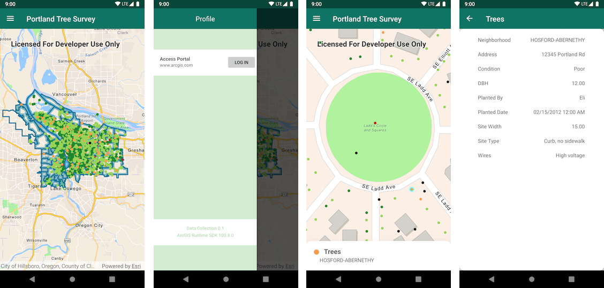

# Data Collection Android

<!-- MDTOC maxdepth:6 firsth1:0 numbering:0 flatten:0 bullets:1 updateOnSave:1 -->

- [SDK Usage](#sdk-usage)   
- [Development Instructions](#development-instructions)   
   - [Fork the repo](#fork-the-repo)   
   - [Clone the repo](#clone-the-repo)   
      - [Command line Git](#command-line-git)   
   - [Configuring a Remote for a Fork](#configuring-a-remote-for-a-fork)   
- [Requirements](#requirements)   
- [Resources](#resources)   
- [Issues](#issues)   
- [Contributing](#contributing)   
- [MDTOC](#mdtoc)   
- [Licensing](#licensing)   

<!-- /MDTOC -->
---

Data Collection for Android shows how a robust application can be built around the ArcGIS Platform using the ArcGIS Runtime SDK for Android and Kotlin. It demonstrates best practices around some simple but key functionality of the ArcGIS Runtime. Using your organization's web maps, you can use Data Collection as is, or extend it to meet your specific needs.



## SDK Usage

Mobile Data Collection leverages several aspects of the Runtime SDK including:

* Identifying map features
* Portal authentication with OAuth 2.0
* Working with Features, Popups and PopupManagers

## Development Instructions
Data Collection is an [Android Studio](http://developer.android.com/sdk/index.html) project and app module that can be directly cloned and imported into Android Studio.

1. Log in to [ArcGIS for Developers](https://developers.arcgis.com/) and [register](https://developers.arcgis.com/applications/#/) your app.


2. Once you've registered the Data Collection app, grab a copy of the client id from the registration and set the `client_id` in the application's `app_settings.xml` file.

```xml
<?xml version="1.0" encoding="utf-8"?>
<resources>

    <!-- TODO: add your own client id here-->
    <string name="client_id">YOUR_CLIENT_ID</string>

    <!-- This redirect URI is the default value for https://www.arcgis.com -->
    <string name="redirect_uri">data-collection://auth</string>

</resources>
```

3. As part of the registration process, add a redirect URI for your app.  Navigate to the Redirect URIs section at the bottom of the registration page and set the redirect URI to `data-collection://auth`.


> Note that the scheme for the `DefaultOAuthIntentReceiver` in the Android Manifest file is derived from the redirect uri.
```xml
        <activity
            android:name="com.esri.arcgisruntime.security.DefaultOAuthIntentReceiver"
            android:label="OAuthIntentReceiver"
            android:launchMode="singleTask">
            <intent-filter>
                <action android:name="android.intent.action.VIEW"/>
                <category android:name="android.intent.category.DEFAULT"/>
                <category android:name="android.intent.category.BROWSABLE"/>

                <data
                        android:host="auth"
                        android:scheme="data-collection"/>
            </intent-filter>
        </activity>
 ```

### Fork the repo
**Fork** the [Data Collection for Android](https://github.com/Esri/data-collection-android/fork) repo.

### Clone the repo
Once you have forked the repo, you can make a local clone.

#### Command line Git
1. [Clone the  Data Collection for Android repo](https://help.github.com/articles/fork-a-repo#step-2-clone-your-fork)
2. ```cd``` into the ```data-collection-android``` folder
3. Make your changes and create a [pull request](https://help.github.com/articles/creating-a-pull-request)

### Configuring a Remote for a Fork
If you make changes in the fork and would like to [sync](https://help.github.com/articles/syncing-a-fork/) those changes with the upstream repository, you must first [configure the remote](https://help.github.com/articles/configuring-a-remote-for-a-fork/). This will be required when you have created local branches and would like to make a [pull request](https://help.github.com/articles/creating-a-pull-request) to your upstream branch.

1. In the Terminal (for Mac users) or command prompt (fow Windows and Linux users) type ```git remote -v``` to list the current configured remote repo for your fork.
2. ```git remote add upstream https://github.com/Esri/data-collection-android``` to specify new remote upstream repository that will be synced with the fork. You can type ```git remote -v``` to verify the new upstream.

If there are changes made in the original repository, you can sync the fork to keep it updated with the upstream repository.

1. In the terminal, change the current working directory to your local project.
2. Type ```git fetch upstream``` to fetch the commits from the upstream repository.
3. ```git checkout master``` to checkout your fork's local master branch.
4. ```git merge upstream/master``` to sync your local `master` branch with `upstream/master`. **Note**: Your local changes will be retained and your fork's master branch will be in sync with the upstream repository.

## Requirements
* [Android Studio](http://developer.android.com/sdk/index.html)

## Resources
* [ArcGIS Runtime SDK for Android Developers Site](https://developers.arcgis.com/android/)
* [ArcGIS Mobile Blog](http://blogs.esri.com/esri/arcgis/category/mobile/)
* [ArcGIS Developer Blog](http://blogs.esri.com/esri/arcgis/category/developer/)
* [twitter@ArcGISRuntime](https://twitter.com/ArcGISRuntime)
* [twitter@esri](http://twitter.com/esri)

## Issues

Find a bug or want to request a new feature enhancement? Let us know by submitting an issue.

## Contributing
Anyone and everyone is welcome to contribute. We do accept pull requests.

1. Get involved
2. Report issues
3. Contribute code
4. Improve documentation

## MDTOC

Generation of this and other documents' table of contents in this repository was performed using the [MDTOC package for Atom](https://atom.io/packages/atom-mdtoc).

## Licensing

Copyright 2020 Esri

Licensed under the Apache License, Version 2.0 (the "License"); you may not use this file except in compliance with the License. You may obtain a copy of the License at

http://www.apache.org/licenses/LICENSE-2.0

Unless required by applicable law or agreed to in writing, software distributed under the License is distributed on an "AS IS" BASIS, WITHOUT WARRANTIES OR CONDITIONS OF ANY KIND, either express or implied. See the License for the specific language governing permissions and limitations under the License.

A copy of the license is available in the repository's [LICENSE](./LICENSE) file.

For information about licensing your deployed app, see [License your app](https://developers.arcgis.com/android/latest/guide/license-your-app.htm).
